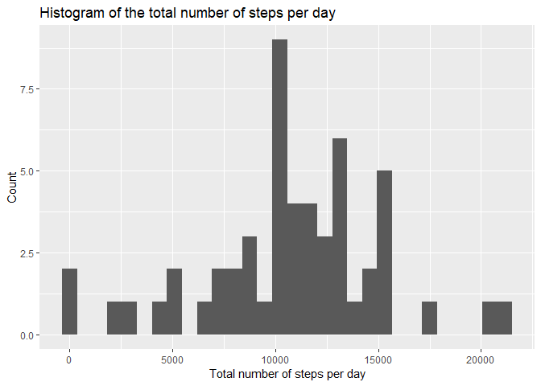
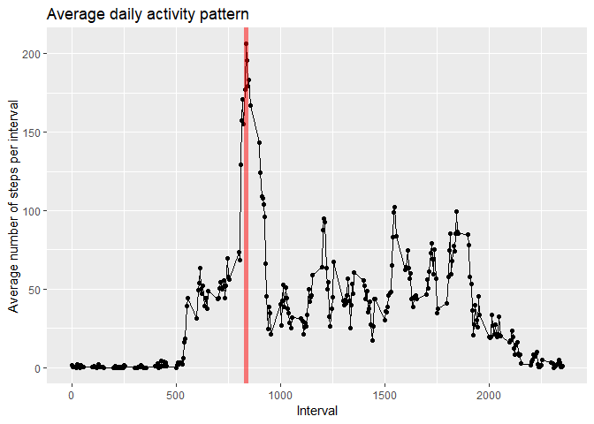
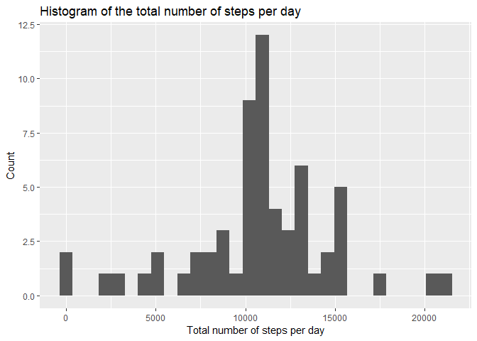
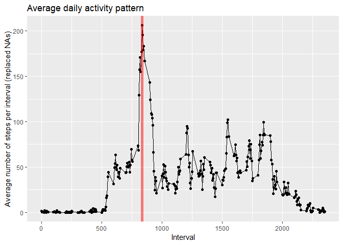
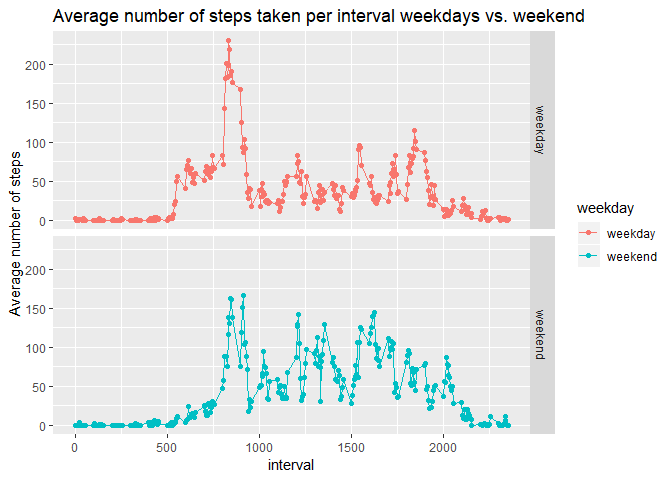

## Loading and preprocessing the data

For the following data analysis the libraries ggplot, dplyr and lubridate will be used.


```r
library(ggplot2)
library(dplyr)
```

```
## 
## Attaching package: 'dplyr'
```

```
## The following objects are masked from 'package:stats':
## 
##     filter, lag
```

```
## The following objects are masked from 'package:base':
## 
##     intersect, setdiff, setequal, union
```

```r
library(lubridate)
```

```
## 
## Attaching package: 'lubridate'
```

```
## The following object is masked from 'package:base':
## 
##     date
```
The code below loads the data into R using the *read.csv()* method. Note that the *unz()* method is called within the function call, to extract the zip data. The **date** column is converted into a lubridate date. The hour of the day and the minute of the hour are computed from the interval variable using integer divsion by 100 and modulo 100. A new column called **datetime** is created containing lubridate datetime objects (created from the **date** column and the **hour_of_day** and **minute_of_hour** columns). The dataframe is converted into table and stored in the variable **df_data**.


```r
#read the data
df_data <- read.csv(unz("activity.zip", "activity.csv"), header = TRUE, sep = ",") %>%
  tbl_df %>%
  mutate(date = ymd(date), hour_of_day = interval %/% 100, minute_of_hour = interval %% 100) %>%
  mutate(datetime = make_datetime(year = year(date), month = month(date), day = day(date), hour = hour_of_day, min = minute_of_hour, sec= 0)) %>%
  select(-hour_of_day, -minute_of_hour)
```


## What is mean total number of steps taken per day?

To get an understanding of the baseline activity level the average total number of steps per day shall be computed. From the dataframe **df_data** the **date** and the **steps** column are selected and grouped by the date. For every group the sum of all steps is computed - NA values are discarded. 


```r
df_total_per_day <- df_data %>%
                          select(date, steps) %>%
                          group_by(date) %>%
                          summarize(sum_of_steps = sum(steps), na.rm = TRUE) 

#plot the results using qplot
qplot(sum_of_steps, data = df_total_per_day, xlab = "Total number of steps per day", ylab = "Count", main = "Histogram of the total number of steps per day" )
```

```
## `stat_bin()` using `bins = 30`. Pick better value with `binwidth`.
```

```
## Warning: Removed 8 rows containing non-finite values (stat_bin).
```

<!-- -->

```r
#Compute mean and median
mean_total_number_steps <- mean(df_total_per_day$sum_of_steps, na.rm = TRUE)
median_total_number_steps <- median(df_total_per_day$sum_of_steps, na.rm = TRUE)

#Show the summary of the dataset
summary(df_total_per_day)
```

```
##       date             sum_of_steps    na.rm        
##  Min.   :2012-10-01   Min.   :   41   Mode:logical  
##  1st Qu.:2012-10-16   1st Qu.: 8841   TRUE:61       
##  Median :2012-10-31   Median :10765                 
##  Mean   :2012-10-31   Mean   :10766                 
##  3rd Qu.:2012-11-15   3rd Qu.:13294                 
##  Max.   :2012-11-30   Max.   :21194                 
##                       NA's   :8
```
The mean of the total number of steps is 1.0766189\times 10^{4} and the median is 10765.


## What is the average daily activity pattern?

The columns **interval** and **steps** are selected from the dataframe **df_data** and grouped by the column **interval**. For each group the the mean is computed and stored in a new column **mean_of_steps_interval**. NA values are discarded.


```r
df_average_pattern <- df_data %>%
                          select(interval, steps) %>%
                          group_by(interval) %>%
                          summarize(mean_of_steps_interval = mean(steps, na.rm = TRUE)) 

#compute the interval with the maximum number of steps
max_interval <- df_average_pattern[which.max(df_average_pattern$mean_of_steps_interval),"interval"]

#Plot the data using qplot from ggplot
q <- qplot(interval,mean_of_steps_interval, data = df_average_pattern, geom = c("point","line"), xlab = "Interval", ylab = "Average number of steps per interval", main = "Average daily activity pattern")
q + geom_vline(xintercept = max_interval[[1]], color = "red", lwd = 2, alpha = 0.5)
```

<!-- -->

On average the interval with the heighest number of steps is 835. The interval is highlighted in the figure above by a red line.

## Imputing missing values

```r
number_of_NA <- sum(is.na(df_data$steps))
number_of_NA
```

```
## [1] 2304
```

There is a total of 2304 missing rows in the dataset that need to be replaced. The dataframe **df_data** is joined with the average pattern dataframe **df_average_pattern** by the column **interval**. 
The **steps** column is mutated to such that NA values are replaced with the average value for that particular interval. The result is stored in **df_data_clean**.


```r
df_data_clean <- inner_join(df_data, df_average_pattern, by = "interval") %>% mutate(steps = ifelse(is.na(steps), mean_of_steps_interval, steps)) %>% select(-mean_of_steps_interval)

df_total_per_day_clean <- df_data_clean %>%
                          select(date, steps) %>%
                          group_by(date) %>%
                          summarize(sum_of_steps = sum(steps)) 

#plot the results using qplot
qplot(sum_of_steps, data = df_total_per_day_clean, xlab = "Total number of steps per day", ylab = "Count", main = "Histogram of the total number of steps per day" )
```

```
## `stat_bin()` using `bins = 30`. Pick better value with `binwidth`.
```

<!-- -->

```r
#Compute mean and median
mean_total_number_steps_clean <- mean(df_total_per_day_clean$sum_of_steps)
median_total_number_steps_clean <- median(df_total_per_day_clean$sum_of_steps)

summary(df_total_per_day_clean)
```

```
##       date             sum_of_steps  
##  Min.   :2012-10-01   Min.   :   41  
##  1st Qu.:2012-10-16   1st Qu.: 9819  
##  Median :2012-10-31   Median :10766  
##  Mean   :2012-10-31   Mean   :10766  
##  3rd Qu.:2012-11-15   3rd Qu.:12811  
##  Max.   :2012-11-30   Max.   :21194
```
The mean of the total number of steps is 1.0766189\times 10^{4} and the median is 1.0766189\times 10^{4}. The values have changed and interestingly the median and mean value are now the same. Recreating the plot from before shows us that the rest of the data remained untouched by this operation.


```r
df_average_pattern_ <- df_data_clean %>%
                          select(interval, steps) %>%
                          group_by(interval) %>%
                          summarize(mean_of_steps_interval = mean(steps, na.rm = TRUE)) 

max_interval <- df_average_pattern[which.max(df_average_pattern_$mean_of_steps_interval),"interval"]

q <- qplot(interval,mean_of_steps_interval, data = df_average_pattern_, geom = c("point","line"), xlab = "Interval", ylab = "Average number of steps per interval (replaced NAs)", main = "Average daily activity pattern")
q + geom_vline(xintercept = max_interval[[1]], color = "red", lwd = 2, alpha = 0.5)
```

<!-- -->

## Are there differences in activity patterns between weekdays and weekends?

We add a new factor column to the cleaned dataframe **df_data_clean** by using lubridate's *wday* function on the date column. The result is then grouped by the weekday factor and the interval. For these groups the mean is computed and stored in the new column **mean_of_steps**.

The result is plotted using qplot and its *facets* function.


```r
df_data_clean_weekday_result <- df_data_clean %>%
                        mutate(weekday = ifelse(wday(date, week_start = 1) %in% c(6,7), "weekend","weekday")) %>%
                        mutate(weekday = as.factor(weekday)) %>%
                        group_by(weekday, interval) %>%
                        summarize(mean_of_steps = mean(steps))

q <- qplot(interval, mean_of_steps, data = df_data_clean_weekday_result, facets = weekday~., color = weekday, geom = c("point", "line"), main = "Average number of steps taken per interval weekdays vs. weekend", ylab = "Average number of steps")
q
```

<!-- -->
We can clearly see that the patterns are different. For weekends the wearer of the device seems to begin moving significantly later.
